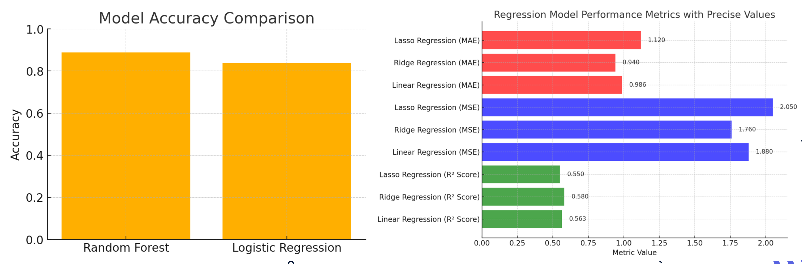
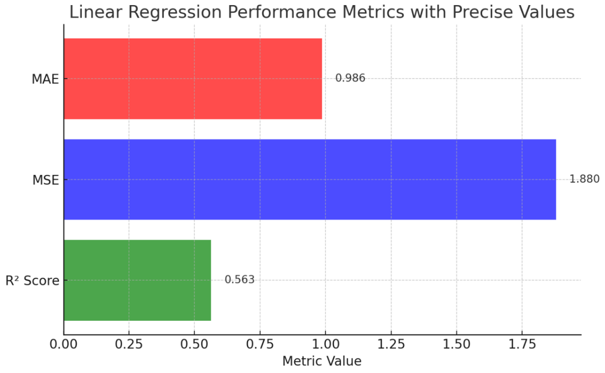
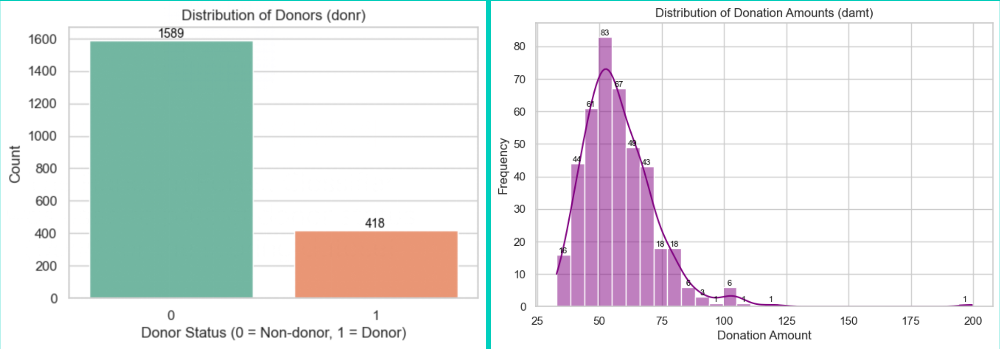
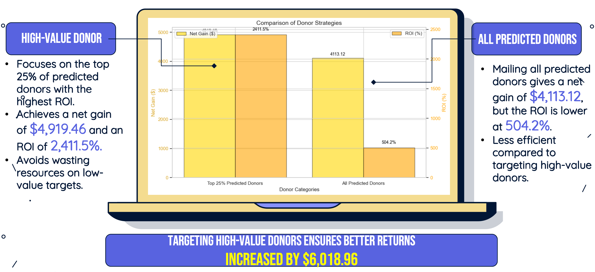

##  Project Overview

This project applies **machine learning** to help a charity organization optimize its **direct mail fundraising strategy**, reducing cost while maximizing return on investment. The goal was two-fold:

-  **Classify potential donors** (who will donate)
-  **Predict donation amounts** for identified donors

---

##  Model Strategy

Two separate models were created:

### 1. **Random Forest Classifier**  
- Predicts whether a person will donate (`donr = 1/0`)
- Achieved **88.85% accuracy** on the test set  
- Identified **408 donors** out of 2007 samples

### 2. **Linear Regression Model**  
- Predicts donation amount (`damt`) for `donr = 1`
- Achieved **R² = 0.56** and **MAE = $0.99**
- Accurate, cost-efficient way to forecast campaign returns

---

##  Data Insights

- **Features grouped by**: demographics, wealth, donation history  
- Strong predictors: lifetime giving (`lgif`, `rgif`), property value (`avhv`), income (`incm`)  
- Most monetary values were **right-skewed** → normalized/scaled during preprocessing  
- Heatmaps showed low correlation between wealth & donation, confirming need for advanced models

---

##  Model Development

- **Tools**: Python, Pandas, scikit-learn  
- **Preprocessing**:
  - Removed irrelevant features (`ID`, `damt`, `donr`)
  - Feature scaling with StandardScaler
  - Used separate training/test sets
- **Pipeline**:
  - Classification first (filter donors)
  - Then regression on predicted donors only

---

##  Business Value

### 💡 Strategy 1: Focus on Top 25% Predicted Donors
- 102 donors selected  
- Avg donation: **$50.23**  
- ROI: **2,411.5%**  
- Net profit: **$4,919.46**

### 💡 Strategy 2: Mail to All 408 Predicted Donors
- Avg donation: **$12.09**  
- ROI: **504.2%**  
- Net profit: **$4,113.12**

Traditional blanket mailing: **Net loss of $1,099.50**

---

##  Results

- Classification Model: Random forest - due to its ability to handle complex feature interactions and better accuracy
- Prediction Model: Linear Regression - simplicity, interpretability, and efficiency in modeling relationships between predictors and the target variable

- Predict the donation amounts (damt) for donors identified through the classification model
- Provide accurate predictions of donation amounts to optimize resource allocation and enhance the charity's return on investment

- The proportion of donors in the dataset is low, with the majority of the sample being non-donors (1589) and only a small proportion of donors (418) 
- Most of the donations are in the lower range ($0-50), with only a few donations in the higher range.

---

##  Business Problem Solution

By targeting only high-value predicted donors:
- Reduced mailing cost from $4,014 to $204  
- Improved net profit by over **$6,000**
- Demonstrated how ML can guide strategic decision-making in the nonprofit sector

---

📎 **PDF Slide Deck**: [Charity Prediction slides](charity.pptx)  
💻 **Code Repository**: [Charity Prediction Code](charity.ipynb)