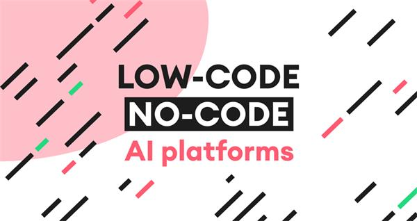
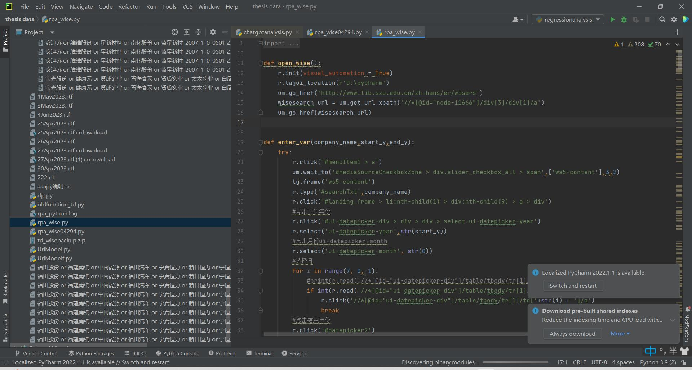
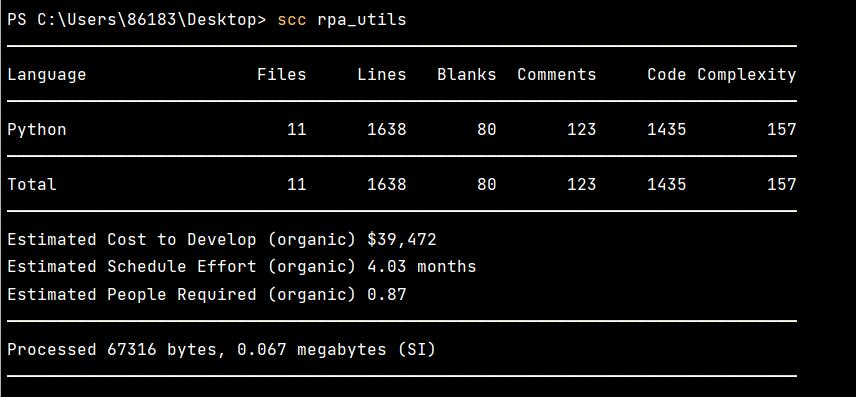

# 🤖 ChatRPA: Empowering Automation with AI + RPA

---

## 📌 Project Overview

**ChatRPA** is an intelligent automation assistant that combines the natural language power of **ChatGPT** with the operational efficiency of **RPA (Robotic Process Automation)**. It enables users—whether individuals or enterprises—to describe their task needs in natural language, and have RPA bots automatically execute them.

---

## 🧠 Key Technologies

| Function             | Technology       |
|----------------------|------------------|
| Prompt Parsing       | ChatGPT / OpenAI |
| Instruction Mapping  | Prompt Engineering |
| Task Execution       | Custom RPA Components (search, type, watch, select, load) |
| Orchestration        | DAG Scheduler + Go backend |
| Interface            | Interactive chat with GPT |

---

## 🔄 Usage Workflow

1. **User describes task** via chat  
2. **ChatGPT interprets & decomposes** steps  
3. Steps are mapped to **programmatic instructions**  
4. RPA components are dynamically composed  
5. RPA executes task & **returns result to user**

🔁 Users can **revise and re-run** the steps until satisfied.  
☁️ All workflows are saved in the cloud for future reuse.

---

## 💡 Application Scenarios

### 🏢 Enterprise Use Case – Bank Monitoring Stock Dividends
- Automatically extracts dividend announcements from stock exchange sites
- Classifies by region/branch
- Emails branch-specific files to account managers

### 🧑‍🔬 Personal Use Case – Academic Researcher
- Pulls provincial newspaper reports about specific companies from WiseSearch
- Downloads thousands of PDFs by date range
- Runs headless with long-time automation

---

## 🚀 Product Value

- ✅ **No-Code Interface** — Chat-based task input lowers barrier for non-tech users  
- ✅ **Modular Automation** — RPA components can be reused & recombined  
- ✅ **Business-Grade Precision** — Prompts guide GPT to output correct flows  
- ✅ **Enterprise & Personal Modes** — Scales from individual use to SaaS platforms

---

## 💰 Cost Analysis

- Initial development cost ~¥50,000  
- Runtime cost per week ~¥1123 (Cloud + API usage)  
- Expansion cost per new RPA module ~¥7000+

---

## 💼 Monetization Strategy

- **B2B SaaS**: Custom platform + tailored modules for enterprises  
- **B2C Subscription**: Ready-to-use modules for automation enthusiasts  
- **Marketplace**: Share/sell user-created automation modules

---

## ⚠️ Risk Considerations

- Technical: Integration stability and prompt precision  
- Compliance: Data privacy concerns with API and third-party access  
- Mitigation: Anonymization, encryption, and potential for domestic AI substitution

---

📎 **Full Report (PDF)**: [Download Here](ChatRPA.pdf)