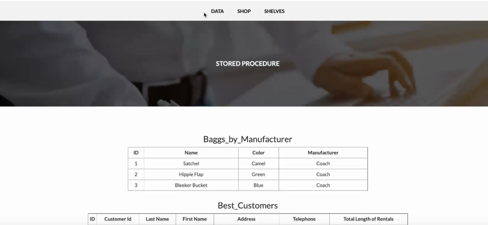
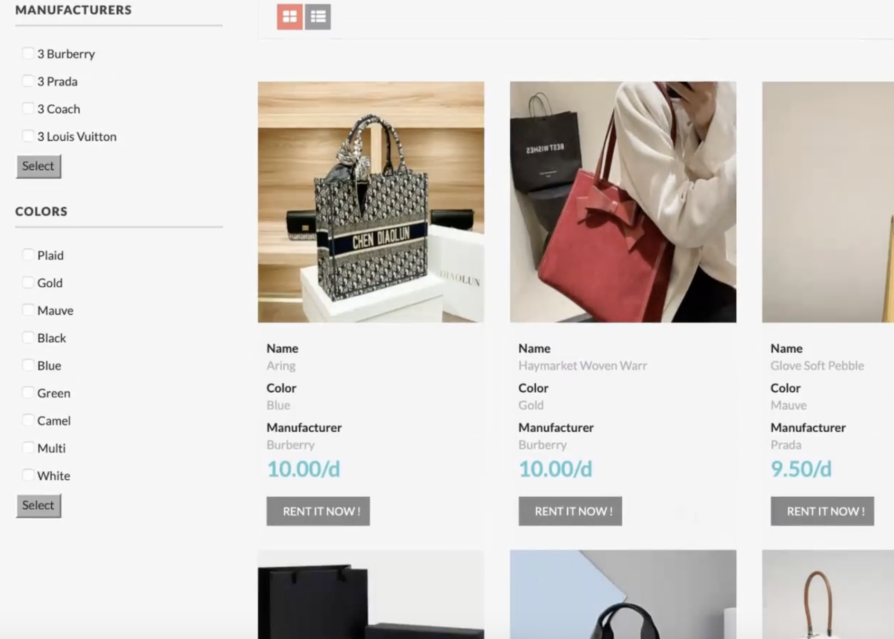

# 👜 Leasing System for Designer Bags – Database & Web Development

---

##  Project Overview

This system is a **rental management platform** for a luxury handbag business built with **MySQL and PHP**. The platform supports **customer shopping, employee data dashboards, and inventory uploads**, demonstrating end-to-end database-driven web development.

Key technologies used:
- PHP (Login, Register, Rent, CRUD logic)
- MySQL (Stored Procedures, Triggers, Views)
- HTML/CSS/JavaScript (Shop UI, form validation)
- phpMyAdmin and XAMPP for environment setup

---

##  Database Design & Features

The system uses **five core relational tables** and several stored routines.

| Table               | Functionality |
|---------------------|---------------|
| `bags`              | Stores bag images and IDs |
| `products`          | Contains brand, price, color, and availability |
| `customer`          | User account and profile data |
| `rent`              | Active rentals |
| `cus_rent_return`   | Logs returns for auditing and reporting |

### Database Functionalities
- Multi-table relational integrity for rental workflows  
- Stored procedures for bag filtering, customer ranking, and transaction summaries  
- Triggers for return calculations and bag availability  
- Data aggregation views for admin dashboards  

---

##  Implementation Breakdown

###  Code Structure

| File/Folder           | Description |
|------------------------|-------------|
| `/php/connection.php` | MySQL connection handler |
| `/php/Rent.php`       | Booking logic & validation |
| `/shop.php`           | Customer shop interface |
| `/data.php`           | Staff dashboard & reporting |
| `/shelves.php`        | Product upload & management |
| `/details.php`        | Bag details page with gallery |
| `/login/` & `/main/`  | Login UI and shop UI assets |

---

##  Building the Database

- Designed relational schema using MySQL  
- Created stored procedures (`Baggs_by_Manufacturer`, `report_customer_amount`)  
- Added triggers to auto-update inventory and log returns  
- Integrated SQL logic into PHP front-end using `mysqli_query` and `CALL` statements

---

##  Data Platform (`data.php`)

- View **customer rental activity**  
- Display **bags by manufacturer**  
- Rank **top customers** by total rental hours  
- Report **total rental income per customer**

---

##  Shopping Platform (`shop.php`)

- Grid/list toggle view  
- Filter by **brand** and **color**  
- Validate rental date & availability  
- Displays stock status and rental button  
- Handles invalid input, unauthorized access, duplicate booking

---

##  Inventory Platform (`shelves.php`)

- Upload new items with image, brand, price  
- Calls stored procedures to insert entries  
- Validates required fields and image format  
- Refreshes product list after insert

---

##  Automation Logic

### On Return
- Trigger calculates total rental time + cost  
- Marks item as available  
- Inserts return into log table

### On Rent
- Prevents rental if overlapping or past date  
- Confirms customer credentials and input integrity

---

##  📌 Debugging Notes

- Upgraded macOS XAMPP to unlock stored procedure support  
- Replaced `$_GET[id]` with `isset()` checks to avoid errors  
- Used `var_dump()` for debugging data propagation  
- Carefully handled SQL joins, foreign keys, session logic  

---

