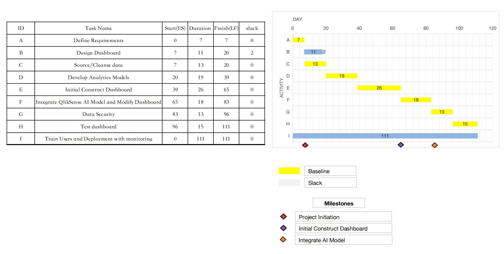
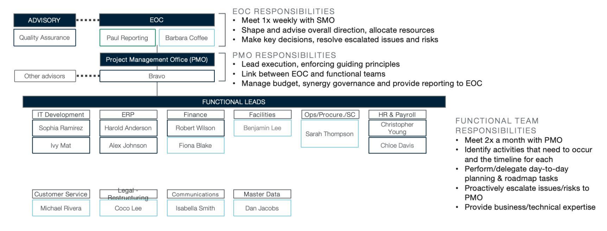
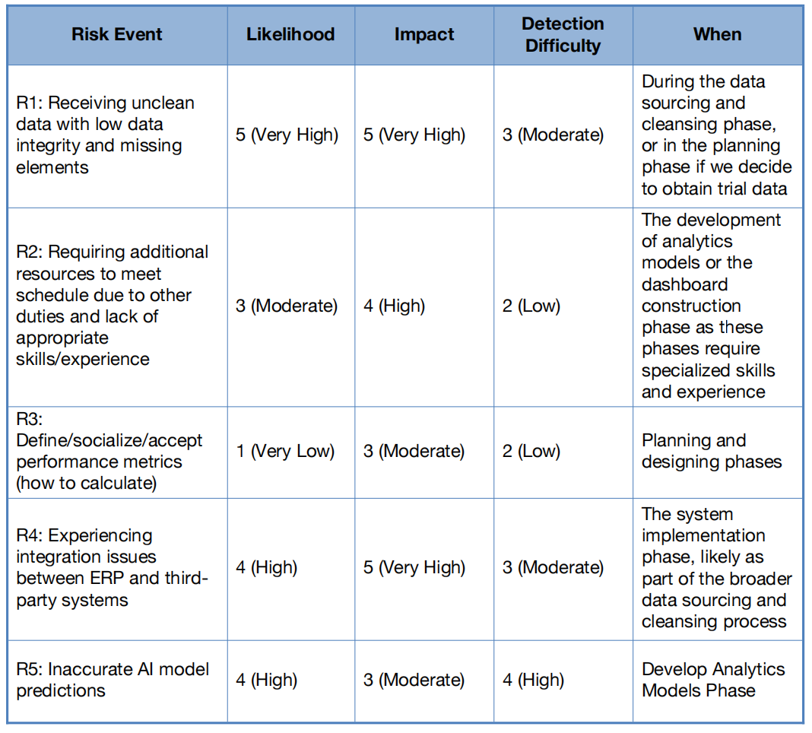

##  Project Summary

FPD Beverage Company suffers from outdated, disconnected systems causing poor forecasting and customer dissatisfaction. This project proposes building a **QlikSense-based real-time analytics dashboard** to enhance decision-making, improve delivery, and protect $350M in annual revenue.

**Budget**: $250,000 (plus 10% contingency)  
**Timeline**: July 1 – Dec 31 (6 months)

---

##  Project Scope & Objectives

###  Objective
Develop a secure, real-time dashboard using **QlikSense AI tools** to visualize:
- Product sales
- Packaging performance
- Delivery metrics by customer

###  Deliverables
- Cloud dashboard (mobile/desktop)
- AI-driven analytics integration
- User training (QlikSense)
- Technical documentation
- Risk management and execution plan

---

##  Work Breakdown & Budget

- WBS includes dashboard UI design, data cleansing, analytics model development, and UAT
- Estimation uses hybrid (top-down + bottom-up) approach
- Example task:  
  - **Build analytics models**: 219.6 hrs @ $110/hr = $24,156  
  - **Configure Qlik dashboard**: 274.5 hrs = $32,195

 **Total Estimated Cost**: $249,765  
 WBS, Gantt, AON diagrams all align

---

##  Milestones

| Milestone | Due |
|-----------|-----|
| Team formation & requirements | 07/31 |
| QlikSense AI Training         | 08/31 |
| Dashboard Design              | 09/30 |
| Prototype Ready               | 10/31 |
| User Testing                  | 11/30 |
| Full Launch                   | 12/31 |

---

##  Communication Strategy

| Audience | Frequency | Channel |
|----------|-----------|---------|
| Sponsor  | Bi-weekly | Reports, Email |
| EOC      | Monthly   | Meetings |
| Team     | Weekly    | Slack, Standups |
| End Users| Monthly   | Reports, Feedback Sessions |

---

##  Risk Management

- **Major Risks**: Low data quality (R1), ERP integration (R4)  
- **Medium Risks**: Model accuracy (R5), resource shortages (R2)  
- Mitigations include: fallback data cleaning, cross-functional task force, retraining, and modular AI deployment

 Risk rating: **Medium-High**  
 ROI tied to successful integration and model output

---

##  Feasibility & Success Metrics

Project success measured by:
- On-time, on-budget delivery
- Accurate, AI-powered dashboards
- Positive user adoption and stakeholder feedback
- Reduction in missed shipments & better performance predictability

---

##  Responsibility Matrix (RACI)

| Task | PM | IT | ERP Analyst | DB Analyst | Supply Chain | Sales |
|------|----|----|-------------|------------|---------------|-------|
| Requirements | R | S | S | S | S | R |
| Dashboard | R | S | S | S | S | R |
| Data Prep  | R | S | R | R | S | S |
| Analytics  | R | S | S | R | S | S |
| UAT & Go-Live | R | S | S | S | S | R |

---

📎 **Full Project Plan (PDF)**: [Download Here](projectplan.pdf)