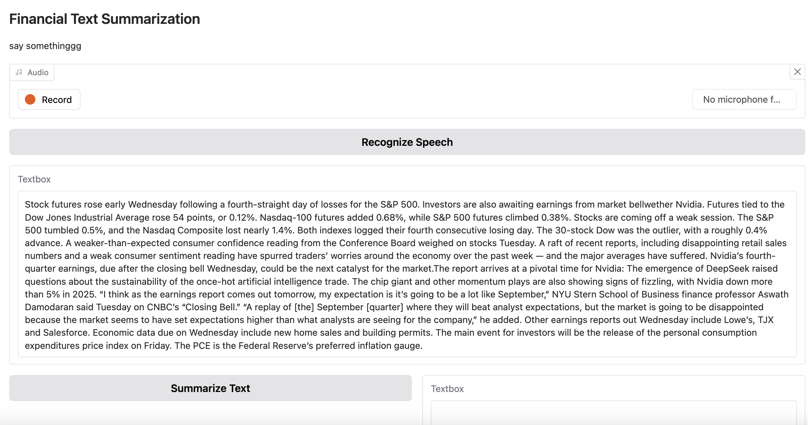

#  Financial Text Summarization Project

📍 **Live App**: [Try it on Hugging Face](https://huggingface.co/spaces/Vickiiiyippp/financial_text_summarization)  

---

##  Problem & Motivation

Financial analysts often face **information overload** when reviewing long earnings reports, transcripts, and market commentary.  
This project builds a transformer-based system to:
- Recognize speech from meetings/calls (Wav2Vec)
- Summarize long financial text (BART)
- Analyze financial sentiment (FinBERT)

 Goal: Deliver fast, digestible, and actionable insights from unstructured financial data.

---

##  Model Architecture

| Task                  | Model Used                                  |
|-----------------------|----------------------------------------------|
| Speech Recognition    | `facebook/wav2vec2-base-960h`               |
| Text Summarization    | `knkarthick/MEETING_SUMMARY` (BART)         |
| Sentiment Analysis    | `yiyanghkust/finbert-tone` (BERT variant)   |

These models are orchestrated in a **Gradio UI**, enabling real-time interaction.

---

##  Workflow

1.  **Speech-to-Text**: Users can record/upload earnings call audio  
2.  **Text Summarization**: BART reduces raw text to 3–4 key financial insights  
3.  **Tone Classification**: BERT classifies sentiment as Positive, Neutral, or Negative  

This pipeline empowers analysts to **quickly identify risks, sentiment, and trends**.

---

##  Technical Highlights

- **Transformer Models**: Leveraged transfer learning from pretrained BERT, BART, and Wav2Vec2  
- **Financial Domain Fine-Tuning**: Enhanced summarization accuracy with finance-specific datasets  
- **Web Deployment**: Hosted on Hugging Face Spaces using Gradio for rapid access  

---

##  Business Value

- Saves analysts **hours of manual review** of financial disclosures  
- Supports **investment decision-making** with real-time sentiment  
- Powers **AI-driven insights** for traders, PMs, and hedge funds  
- Framework is scalable to global markets with future multilingual support  

---

##  Future Enhancements

-  Multilingual report support (e.g. earnings calls in Chinese, Japanese)  
-  Real-time news stream summarization  
-  Integration with automated trading platforms  
-  Continual fine-tuning on latest market data for relevance  

---

📎 **PDF Report**: [Download Here](YE_textsummarizaion.pdf)  
🔗 **Live Demo**: [https://huggingface.co/spaces/Vickiiiyippp/financial_text_summarization](https://huggingface.co/spaces/Vickiiiyippp/financial_text_summarization)